# KrabGame 

Een Unity-project dat ik als leer- en showcase-project heb ontwikkeld.  
In deze repo staan de **C# scripts** en projectstructuur, zodat je mijn code en werkwijze kunt bekijken.

---

## Features
- Geschreven in **C#** binnen Unity.
- Project opgezet met oog op schaalbaarheid en herbruikbaarheid.

---

## Wat hier niet in zit
- Grote assets (textures, modellen, audio).
- Builds van de game.

Daardoor is de game **niet direct speelbaar vanuit deze repo**.  
Wil je de volledige build of alle assets zien? Neem gerust contact op.

---

## Technologieën
- **Unity** (2021.3 LTS)
- **C#**
- Git / GitHub

---

## 📷 Screenshots

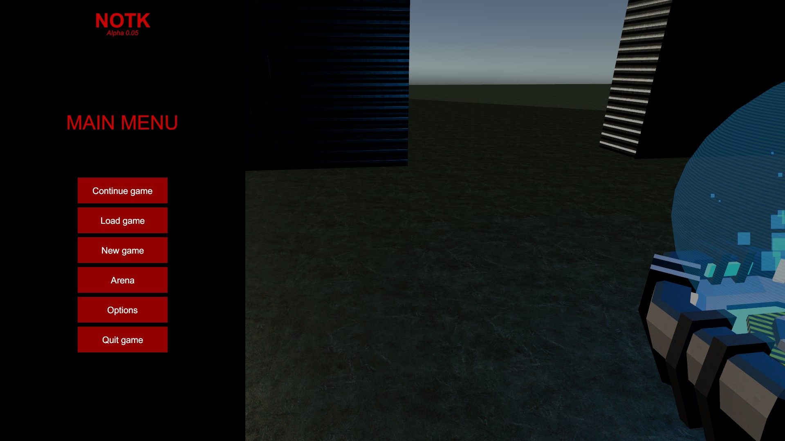 
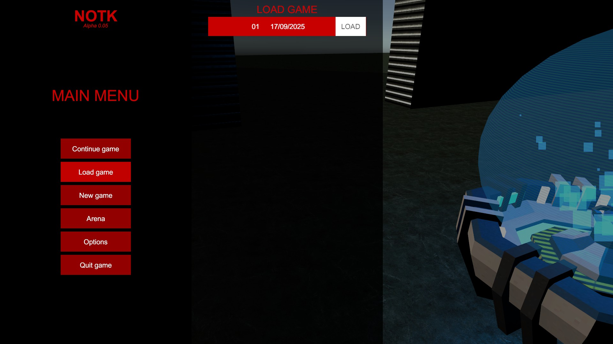  
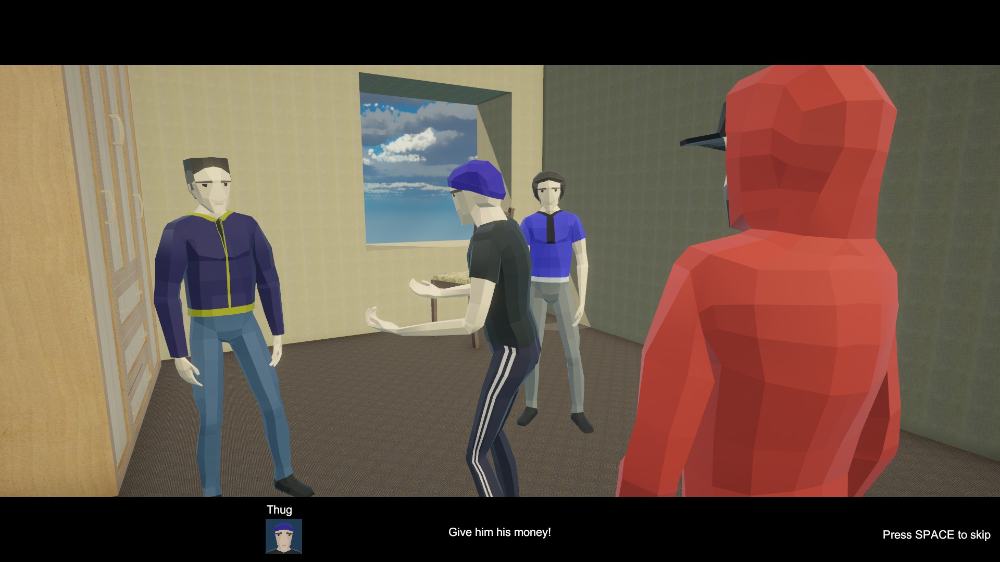  
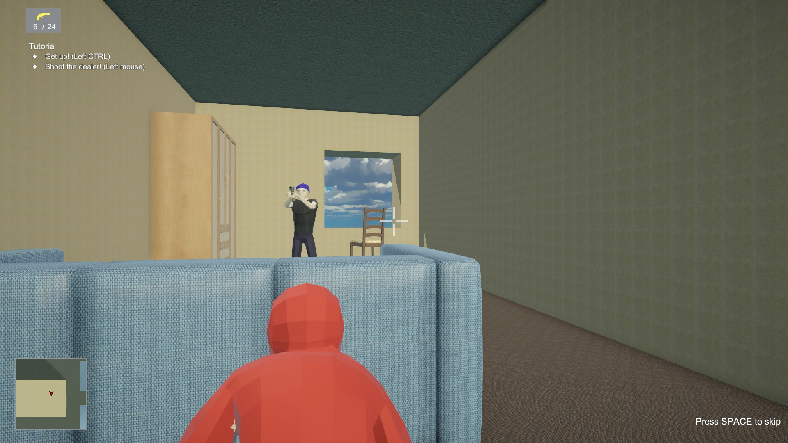  
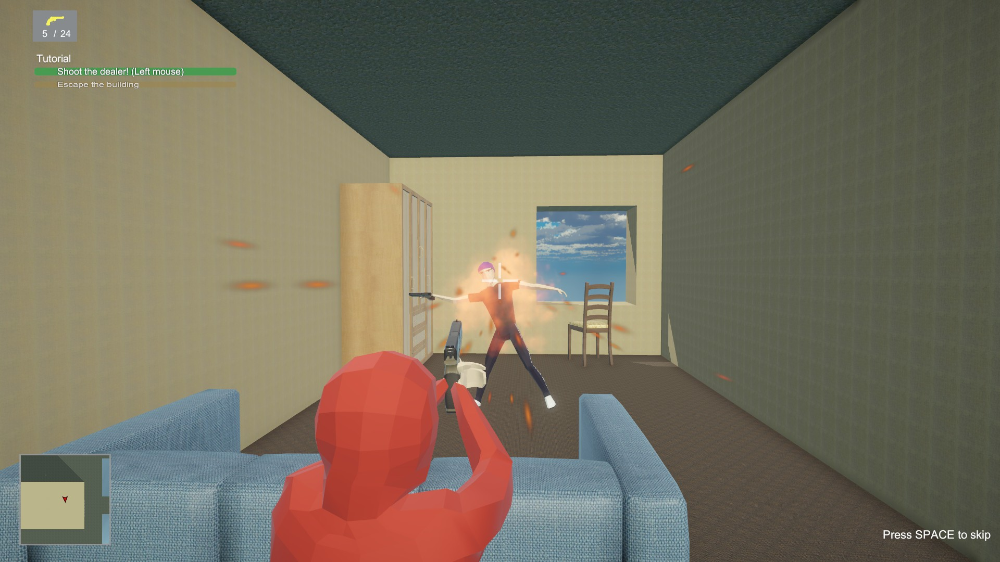 
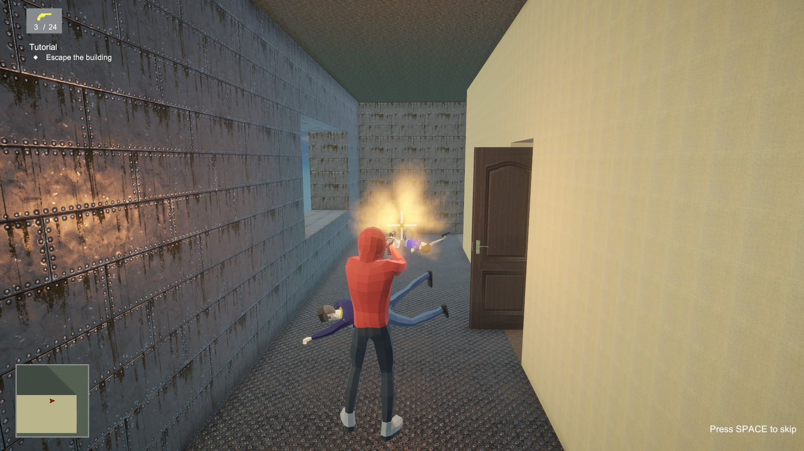 
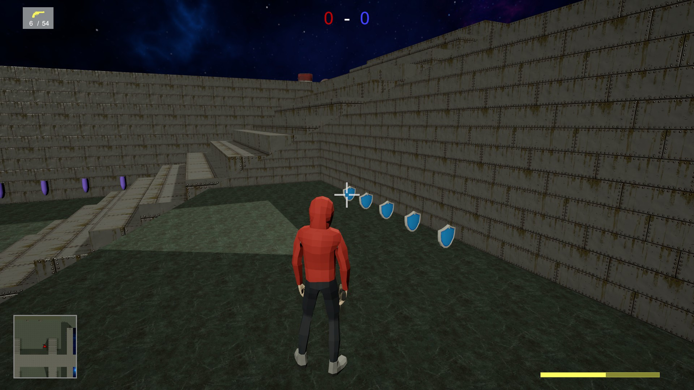  
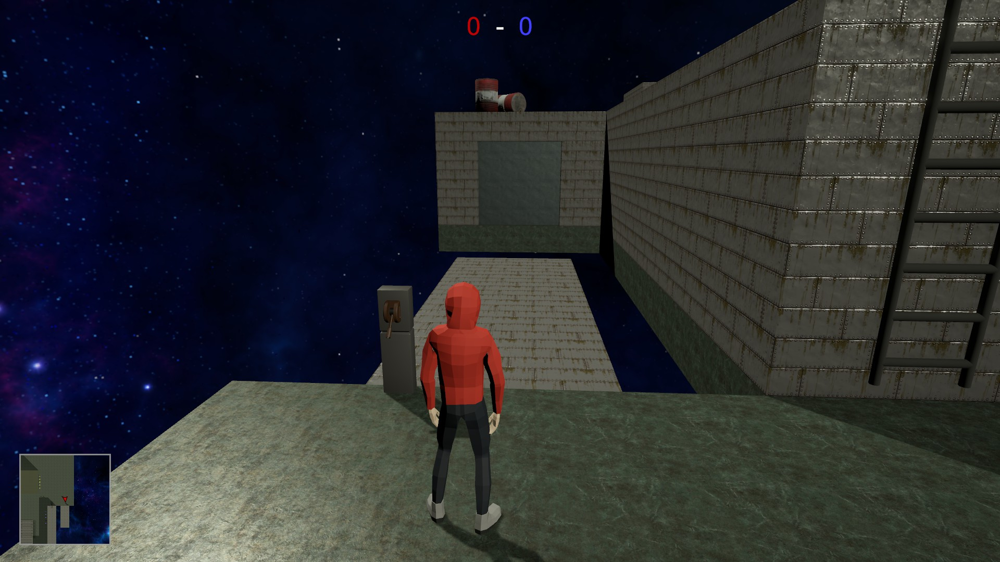
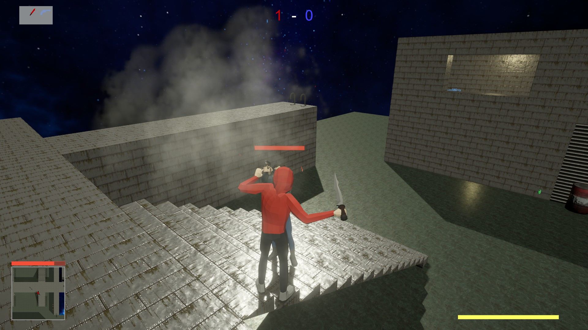   
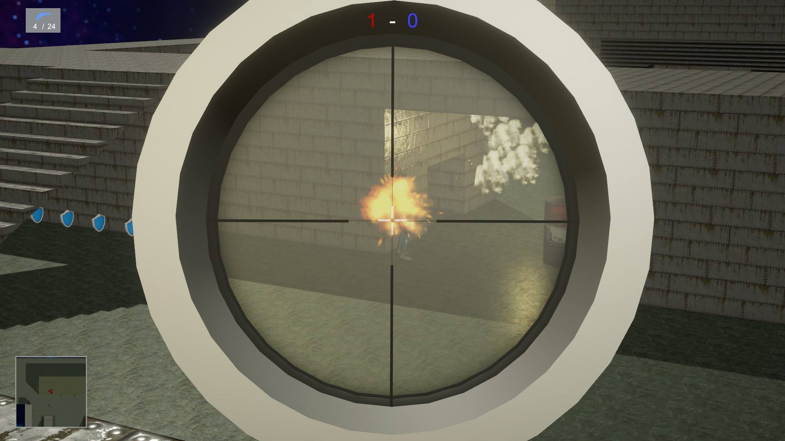 
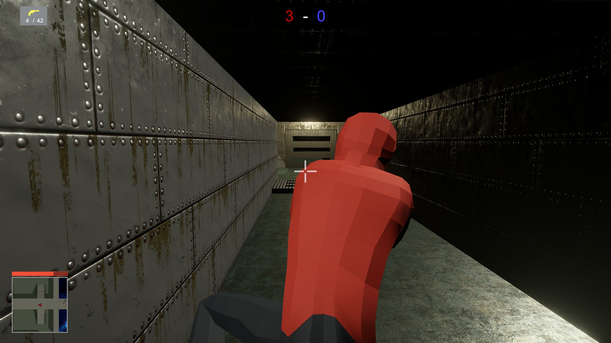 
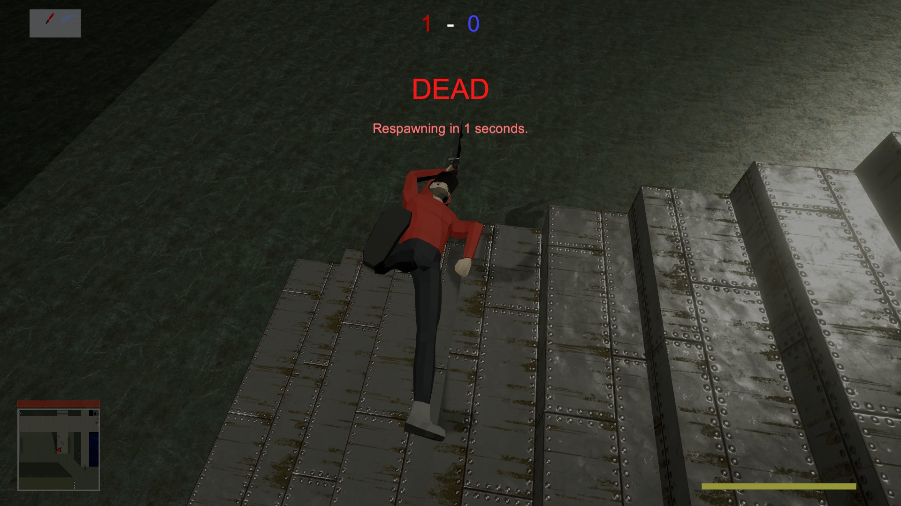  
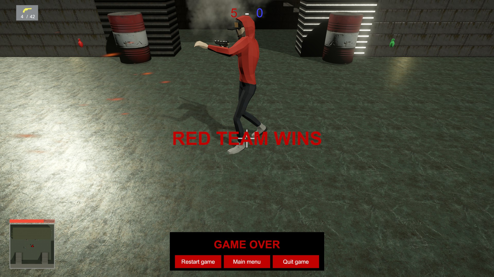 

---

## Speelbare versie
[Download de build via GitHub Releases](https://github.com/BjornElsing/KrabGame/releases)

---

## Documentatie
[Download de documentatie (docx)](Docs/KrabGame.docx)
[Download de documentatie (docx)](Docs/KrabGame2.docx)
